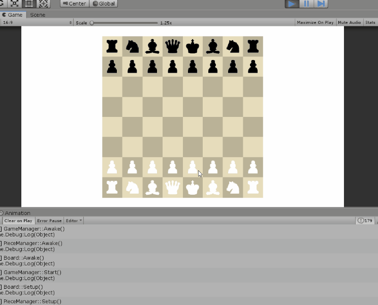

# Chess2D

## About This Project

A local multiplayer 2D Chess game made in Unity.

### **Date**: 6/6/2019
### **Goal**: Make a 2D turn-based board game in Unity
### **What I Have Learned**:
Sprites, Animation, chess programming, drawing, scene hierarchy. The most time I spent was programming the logic of each piece.
### **Things To Work On**:
Can implement castle move, also maybe limit moves when king is checked. Maybe make it multiplayer over the network!

### **Reference**:
I've only borrowed ideas, everything in this project is coded by myself.